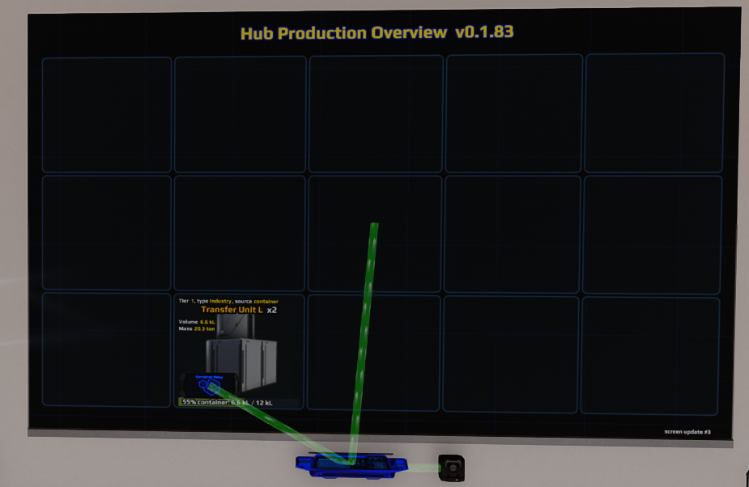
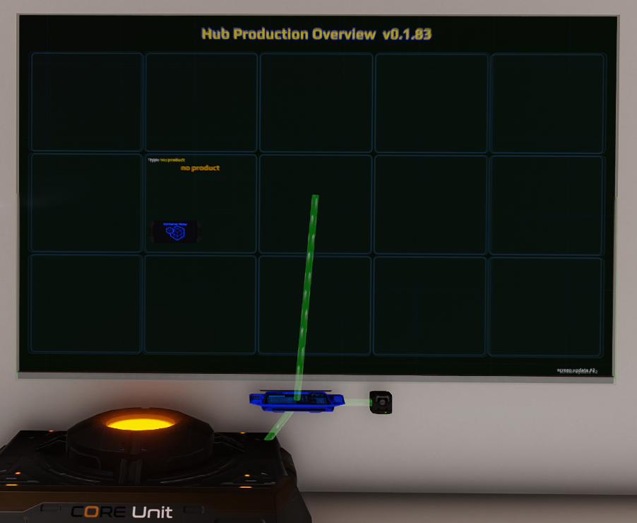

# Linked Hub Production Screen

This project contains a Dual Universe Programming Board controller that shows
nearby Container Hubs and their products on a Screen grid.

## Beginner setup

### Step 1: place and link the elements

Use either of these setups:

1. Place a Programming Board (PB), Screen, Databank, and Container Hub. Link the
   PB directly to the Screen, Databank, and Container Hub.
2. Place a PB, Screen, Databank, and Core Unit. Link the PB to the Screen,
   Databank, and Core. The Core allows the script to discover nearby Container
   Hubs and their linked Industry Units.

### Step 2: install the configuration

Open
[`pb-hub-screen-controller.generated.json`](pb-hub-screen-controller/pb-hub-screen-controller.generated.json),
copy its complete text, and use **Paste Lua configuration from clipboard** on
the PB.

### Step 3: start the PB

Activate the Programming Board. The Screen should display the title and the
default 3×5 grid.

### Step 4: position the Hub

Place the Container Hub close to the Screen and aligned with one of its grid
cells. The script projects the Hub position onto the Screen plane and displays
it in the corresponding cell.

## Example results

PB linked directly to the Screen, Databank, and Container Hub:



PB linked to the Screen, Databank, and Core Unit:



## What product information appears

- If the PB is linked directly to a Container Hub and the Hub contains items,
  the Screen shows that container content and capacity.
- If a Hub is the output container of an Industry Unit discovered through the
  Core, the Screen shows the Industry product. Industry information may not
  always update immediately.
- A direct Hub link and a Core link may be used together, allowing the cell to
  combine available container and Industry information.

The working source and installation guide are in
[`pb-hub-screen-controller`](pb-hub-screen-controller/README.md).

The PowerShell builder creates a complete paste-ready PB configuration directly
from the Lua files. It does not require an exported JSON template.

```powershell
cd "pb-hub-screen-controller"
.\build-lua-configuration.ps1 -CopyToClipboard
```

Paste the result with the Programming Board action **Paste Lua configuration
from clipboard**. After pasting, review the exported debug parameters and adjust
the four grid-margin parameters for the physical size and usable area of your
Screen.
