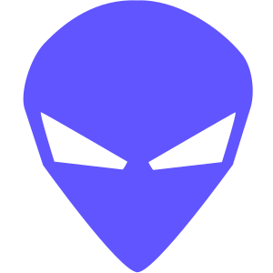
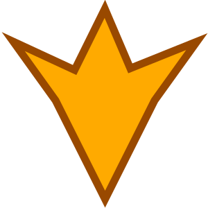
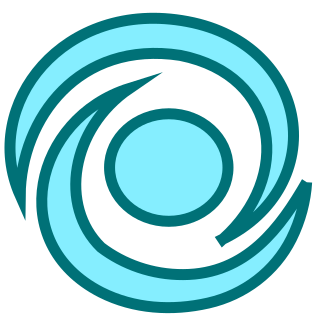
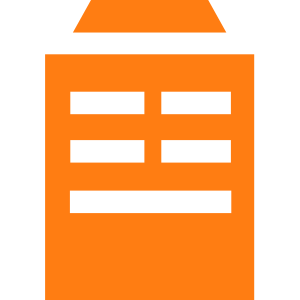
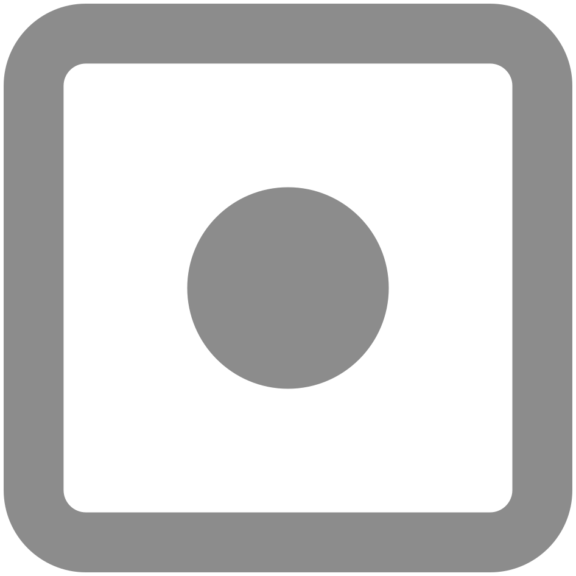

# Dual Universe F1 SVG Gallery

GitHub renders the individual SVG assets below in repository Markdown. For interactive search, use `f1-svg-gallery.html` locally or through GitHub Pages.

## D-F

## G-I

## M-O

## P-R

## S-U

